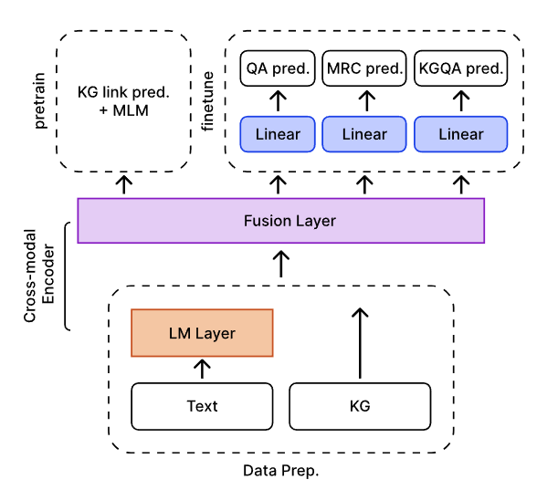

# Joint Multitask Finetuning on Pretrained KG-enhanced LLM for Downstream Tasks

This repo provides the **source code & data** of our paper "Multitask Finetuning on Pretrained KG-enchanced LLM for Question Answering and Machine Reading Comprehension Tasks".





## 0. Dependencies
Installation guide for training **Roberta** with H/A 100  

**Requirements:** python3.8, cuda11.8, torch2.0.1, pyg2.4, transformers4.10

Run the following commands to create a conda environment:

```bash
mamba create -y -n multitask_finetune python=3.8
mamba activate multitask_finetune
mamba install pytorch torchvision torchaudio pytorch-cuda=11.8 pyg=2.4 pytorch-sparse=0.6.17 -c pytorch -c nvidia -c pyg
pip install transformers==4.10 wandb nltk spacy==2.1.6
python -m spacy download en
pip install scispacy==0.3.0
pip install sentencepiece
```

## 1. Download pretrained models

Download pretrained models and place files under `./models`

| Model  | Size | Pretraining Text | Pretraining Knowledge Graph | Download Link |
| ------------- | --------- | ---- | ---- | ---- |
| RoBERTa | 360M parameters | BookCorpus (filtered) | ConceptNet | link (will be updated) |


## 2. Download data

Download all the preprocessed data from [here](https://sc.link/Vke9N) (596 GB), kgqa data [here](https://sc.link/tfeLW) (2 GB).

## 3. How to train

If you would like to train model on single task, run: 
```
scripts/run_train__{qa/mrc/kgqa_dataset_name}.sh
```

For joint training, run (don't forget to specify the task flags):
```
scripts/run_train__joint.sh
```

**(Optional)** To pretrain model on your own data, you can run:
```
scripts/run_pretrain.sh
```

## Acknowledgment
This repo is built upon the following works:
```
DRAGON: Deep Bidirectional Language-Knowledge Graph Pretraining
[https://github.com/snap-stanford/GreaseLM](https://github.com/michiyasunaga/dragon)
```
